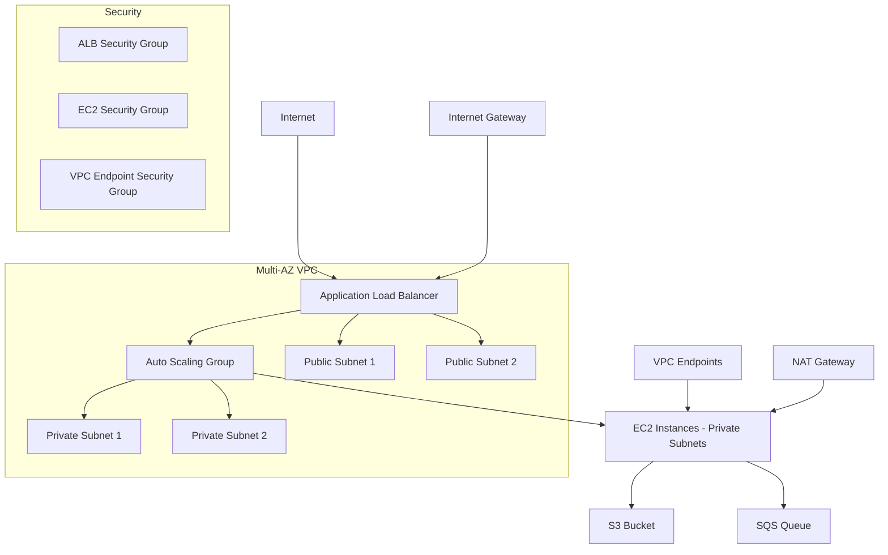

# AWS Web Application Infrastructure Terraform Module

A comprehensive Terraform module for deploying a production-ready web application infrastructure on AWS with high availability, auto-scaling, and security best practices.

## Features

- ✅ **High Availability VPC**: Multi-AZ deployment with public and private subnets
- 🚀 **Auto Scaling**: EC2 instances with Application Load Balancer
- 🔒 **Security Groups**: Layered security with least-privilege access
- 📦 **S3 Storage**: Video/asset storage with proper IAM policies
- 📊 **Monitoring**: CloudWatch integration with SSM support
- 🌐 **VPC Endpoints**: Cost-optimized private connectivity
- 👥 **Developer Access**: IAM users with appropriate permissions
- 🏷️ **Resource Tagging**: Consistent resource organization

## Architecture



## Prerequisites

- Terraform >= 1.0
- AWS Provider >= 4.0
- AWS CLI configured with appropriate permissions
- SSL certificate in AWS Certificate Manager
- SSH key pair for EC2 access

## Quick Start

```hcl
module "web_app_infrastructure" {
  source = "./path/to/this/module"

  # VPC Configuration
  vpc_name       = "web-app-vpc"
  vpc_cidr_block = "10.0.0.0/16"
  
  public_subnet_count  = 2
  private_subnet_count = 2

  # Application Configuration
  instance_type       = "t3.medium"
  ssh_key_name       = "my-key-pair"
  acm_certificate_arn = "arn:aws:acm:us-east-1:123456789012:certificate/abc123"

  # Auto Scaling
  asg_desired_capacity = 2
  asg_min_size        = 1
  asg_max_size        = 5

  # Storage
  s3_bucket_prefix = "my-app-videos"
  sqs_queue_name   = "video-processing-queue"

  # Developer Access
  developer_user_count = 3
}
```

## Module Structure

```
.
├── main.tf                    # Main infrastructure resources
├── variables.tf               # Input variables
├── outputs.tf                # Output values
├── user_data.sh.tpl          # EC2 user data template
└── README.md
```

## Variables Reference

### Required Variables

| Variable | Type | Description | Example |
|----------|------|-------------|---------|
| `ssh_key_name` | `string` | EC2 Key Pair name | `"my-key-pair"` |
| `acm_certificate_arn` | `string` | SSL certificate ARN | `"arn:aws:acm:..."` |

### Optional Variables

#### VPC & Networking

| Variable | Type | Default | Description |
|----------|------|---------|-------------|
| `vpc_name` | `string` | `"ai-video-vpc"` | Name for the VPC |
| `vpc_cidr_block` | `string` | `"10.0.0.0/16"` | CIDR block for VPC |
| `public_subnet_count` | `number` | `2` | Number of public subnets |
| `private_subnet_count` | `number` | `2` | Number of private subnets |
| `igw_name` | `string` | `"ai-video-igw"` | Internet Gateway name |
| `nat_gateway_name` | `string` | `"ai-video-nat-gw"` | NAT Gateway name |
| `public_route_table_name` | `string` | `"public-rt"` | Public route table name |
| `private_route_table_name` | `string` | `"private-rt"` | Private route table name |

#### EC2 & Auto Scaling

| Variable | Type | Default | Description |
|----------|------|---------|-------------|
| `instance_type` | `string` | `"t3.micro"` | EC2 instance type |
| `asg_desired_capacity` | `number` | `1` | ASG desired capacity |
| `asg_min_size` | `number` | `1` | ASG minimum size |
| `asg_max_size` | `number` | `3` | ASG maximum size |
| `ec2_instance_name` | `string` | `"ai-video-ec2"` | EC2 instance name tag |
| `launch_template_prefix` | `string` | `"ai-video-lt"` | Launch template name prefix |

#### Load Balancer

| Variable | Type | Default | Description |
|----------|------|---------|-------------|
| `alb_name` | `string` | `"ai-video-alb"` | Application Load Balancer name |
| `target_group_name` | `string` | `"ai-video-tg"` | Target group name |

#### Security Groups

| Variable | Type | Default | Description |
|----------|------|---------|-------------|
| `alb_sg_name` | `string` | `"alb-sg"` | ALB security group name |
| `ec2_sg_name` | `string` | `"ec2-sg"` | EC2 security group name |
| `vpce_sg_name` | `string` | `"vpce-sg"` | VPC Endpoint security group name |

#### Storage & Queue

| Variable | Type | Default | Description |
|----------|------|---------|-------------|
| `s3_bucket_prefix` | `string` | `"ai-video-generation"` | S3 bucket name prefix |
| `s3_bucket_name_tag` | `string` | `"video-bucket"` | S3 bucket name tag |
| `sqs_queue_name` | `string` | `"video-generation-queue"` | SQS queue name |
| `sqs_queue_name_tag` | `string` | `"video-queue"` | SQS queue name tag |

#### IAM

| Variable | Type | Default | Description |
|----------|------|---------|-------------|
| `developer_user_count` | `number` | `2` | Number of developer IAM users |
| `ec2_role_name` | `string` | `"ec2-cloudwatch-role"` | EC2 IAM role name |
| `ec2_instance_profile_name` | `string` | `"ec2-instance-profile"` | EC2 instance profile name |

#### Other

| Variable | Type | Default | Description |
|----------|------|---------|-------------|
| `aws_region` | `string` | `"us-east-1"` | AWS region |

## Usage Examples

### Basic Development Setup

```hcl
module "dev_web_app" {
  source = "./modules/web-app-infrastructure"

  # Basic VPC
  vpc_name       = "dev-web-app"
  vpc_cidr_block = "10.0.0.0/16"

  # Minimal resources
  public_subnet_count  = 2
  private_subnet_count = 2
  
  instance_type        = "t3.micro"
  asg_desired_capacity = 1
  asg_min_size        = 1
  asg_max_size        = 2

  # SSL Certificate
  acm_certificate_arn = "arn:aws:acm:us-east-1:123456789012:certificate/dev-cert"
  ssh_key_name       = "dev-key"

  # Storage
  s3_bucket_prefix = "dev-app-storage"
  sqs_queue_name   = "dev-processing"

  developer_user_count = 2
}
```

### Production Setup

```hcl
module "prod_web_app" {
  source = "./modules/web-app-infrastructure"

  # Production VPC
  vpc_name       = "prod-web-app"
  vpc_cidr_block = "10.1.0.0/16"

  # High availability
  public_subnet_count  = 3
  private_subnet_count = 3
  
  instance_type        = "t3.large"
  asg_desired_capacity = 4
  asg_min_size        = 2
  asg_max_size        = 10

  # SSL Certificate
  acm_certificate_arn = "arn:aws:acm:us-east-1:123456789012:certificate/prod-cert"
  ssh_key_name       = "prod-key"

  # Storage
  s3_bucket_prefix = "prod-app-storage"
  sqs_queue_name   = "prod-video-processing"

  developer_user_count = 5

  # Custom naming
  alb_name          = "prod-web-alb"
  target_group_name = "prod-web-tg"
}
```

## Outputs

| Output | Description |
|--------|-------------|
| `alb_dns_name` | DNS name of the Application Load Balancer |
| `bucket_name` | Name of the S3 bucket used for video generation |
| `queue_url` | URL of the SQS queue for video generation |
| `asg_name` | Name of the Auto Scaling Group |
| `developer_iam_users` | List of IAM developer usernames |
| `vpc_id` | ID of the main VPC |
| `public_subnet_ids` | List of public subnet IDs |
| `private_subnet_ids` | List of private subnet IDs |
| `ec2_security_group_id` | Security group ID for EC2 instances |
| `alb_security_group_id` | Security group ID for ALB |
| `launch_template_id` | ID of the EC2 Launch Template |

## Key Features

### High Availability
- Multi-AZ deployment across all availability zones in the region
- Auto Scaling Group with health checks
- Application Load Balancer with health monitoring
- NAT Gateway for private subnet internet access

### Security
- Layered security groups with least-privilege access
- Private subnets for application instances
- VPC endpoints for secure AWS service access
- IAM roles with minimal required permissions
- SSL/TLS termination at the load balancer

### Storage & Queuing
- S3 bucket for video/asset storage with random suffix
- SQS queue for asynchronous processing
- Proper IAM policies for developer access

### Monitoring & Management
- CloudWatch agent integration via IAM roles
- SSM access for instance management
- VPC Flow Logs capability through VPC endpoints

### Developer Experience
- Configurable number of developer IAM users
- S3 read/write permissions for application assets
- EC2 describe permissions for infrastructure visibility

## Deployment

1. **Prerequisites Setup**:
   ```bash
   # Create SSH key pair
   aws ec2 create-key-pair --key-name my-web-app-key --query 'KeyMaterial' --output text > my-web-app-key.pem
   chmod 400 my-web-app-key.pem
   
   # Request SSL certificate
   aws acm request-certificate --domain-name yourdomain.com --validation-method DNS
   ```

2. **Initialize and Deploy**:
   ```bash
   terraform init
   terraform plan
   terraform apply
   ```

3. **Access Your Infrastructure**:
   - Load balancer DNS name will be provided in outputs
   - SSH access to instances through bastion or Systems Manager
   - S3 bucket created with developer access configured

## Best Practices Implemented

### Security
- Private subnets for application instances
- Security groups with minimal required access
- IAM roles following least-privilege principle
- VPC endpoints to avoid internet traffic for AWS services
- SSL/TLS encryption in transit

### High Availability
- Multi-AZ deployment
- Auto Scaling Group with health checks
- Load balancer health monitoring
- Redundant private subnets

### Cost Optimization
- Gateway VPC endpoint for S3 (no data processing charges)
- Interface endpoints only where needed
- Right-sized default instance types
- Auto Scaling based on demand

### Operational Excellence
- CloudWatch integration ready
- SSM access for management
- Consistent resource tagging
- Infrastructure as Code

## Troubleshooting

### Common Issues

1. **SSL Certificate ARN**: Ensure your ACM certificate is in the same region as your deployment
2. **SSH Key**: The key pair must exist in the target AWS region before deployment
3. **Subnet Limits**: Default configuration supports regions with at least 2 AZs
4. **S3 Bucket Naming**: Bucket names are globally unique; the module adds a random suffix

### Debugging

- Check Auto Scaling Group activity for instance launch issues
- Review security group rules if connectivity problems occur
- Verify IAM roles and policies for permission issues
- Use VPC Flow Logs to debug network connectivity

## Contributing

This module follows standard Terraform best practices:
- Use semantic versioning for releases
- Include comprehensive variable validation
- Provide clear documentation and examples
- Follow AWS naming conventions
- Implement proper resource tagging